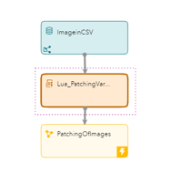
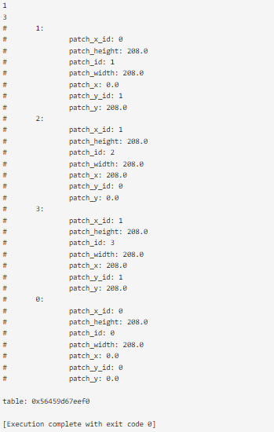
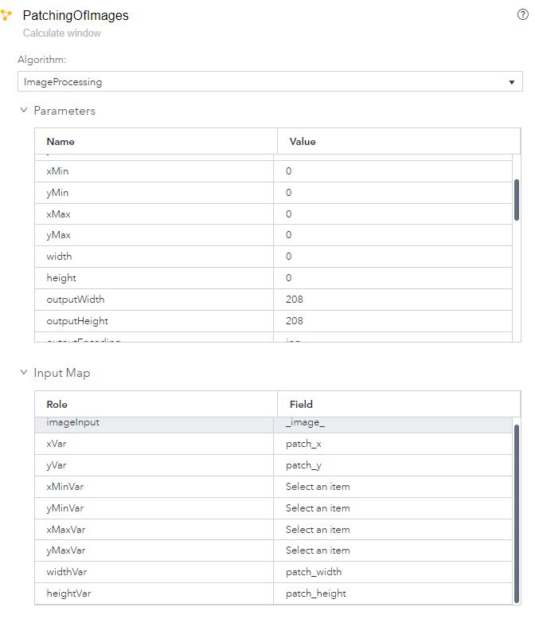
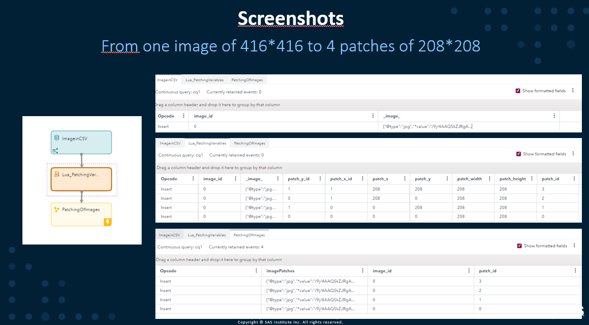

# Lua Image Patches and Cropping

This project gives an example on how to create four smaller images or patches out of one larger image using a Lua window and a Calculate window.  The input is one 416 by 416 image and the output will be four 208 by 208 patches.
The script can be easily adapted and made dynamic to generate the number and size of patches that fit your business need. 

# Process overview



The very first window is a source window that reads a csv file that contains one image encoded in base64 that has a 416*416 pixels format.

The second window is a Lua window that takes 3 hard coded parameters 

1. image width = 416 
2.  image height = 416 
3. number of patches = 4 

The window outputs the number of events that correspond to the number of patches and computes 7 extra variables that will be used by the calculate window which does the cropping.

The third window is a calculate window that takes the cropping parameters from the Lua window and generates the 4 new images of size 208*208.

# Lua window

The three initial variables are hardcoded. They could also directly come from an event.  The function returns a table "events".  The "events" table will contain an array consisting of 4 tables indexed by "patch_id", one for each patch.  Each "patch_id" indexed table contains all the parameters needed to crop the image. 


```lua
-- hardcoded parameters of the Lua function as numeric variables 

local patches = 4  --number of patches to create
local image_width = 416  --width of the input image
local image_height = 416  --height of the input image

-- new variables created by the Lua function that will be used as parameter for cropping

local patch_id = 0 -- id of the patch 
local patch_y_id = 0 --id on the vertical axis of the patch 
local patch_x_id = 0 --id on the horizontal axis of the patch
local val_y = 0 --position on the vertical axis on where to start the cropping of the patch
local val_x = 0 --position on the horizontal axis on where to start the cropping of the patch
local val_width = 0 --width of the patch
local val_height = 0 --height of the patch

function generate_evt(data,context)

local events = {} --table that will contain all the tables with patches and the new variables 

    while (patch_x_id < patches/2) do  --loop across the horizontal axis 
    
        patch_y_id = 0 --reinitialize the vertical axis loop after each horizontal loop
    
        while (patch_y_id < patches/2) do --loop across the vertical axis
            
            local e = {} --reinitialize the value in the patch_id table at each loop
        
            e.patch_x = val_x + (image_width / (patches/2))* patch_x_id --calculate the position on the horizontal axis on where to start the cropping of the patch
            e.patch_width = image_width / (patches/2) --calculate the width of the patch
            e.patch_height = image_height / (patches/2) --calculate the height of the patch
            
            e.patch_y = val_y + (image_height / (patches/2))* patch_y_id --calculate the position on the vertical axis on where to start the cropping of the patch
            
            e.patch_y_id = patch_y_id --saves the id on the vertical axis of the patch in patch_id table
            e.patch_x_id = patch_x_id --saves the id on the horizontal axis of the patch in patch_id table
            e.patch_id = patch_id --saves the id on the horizontal axis of the patch in patch_id table
            events[patch_id] = e --saves the patch_id table in the events table
            
            patch_y_id = patch_y_id + 1  --updates the vertical axis loop variable 
                                         
            patch_id =  patch_id + 1 --updates the patch id variable 
        
        end
        
        patch_x_id = patch_x_id + 1 --updates the horizontal axis loop variable 
    
    end

return(events)
end
```


# Lua development and the events table

Creating and debugging Lua functions directly in SAS ESP can be fairly complicated.

I used  https://www.mycompiler.io/new/lua

I ran the following code. The print_r functions enables to print the full table at many steps in the loop and at the end to validate the content of the "events" table that is created. 

```lua
function print_r(arr, indentLevel)
local str = ""
local indentStr = "#"

if(indentLevel == nil) then
    print(print_r(arr, 0))
    return
end

for i = 0, indentLevel do
    indentStr = indentStr.."\t"
end

for index,value in pairs(arr) do
    if type(value) == "table" then
        str = str..indentStr..index..": \n"..print_r(value, (indentLevel + 1))
    else 
        str = str..indentStr..index..": "..value.."\n"
    end
end
return str
end

local image_width = 416
local image_height = 416

local patch_id = 0
local patch_y_id = 0
local patch_x_id = 0
local val_x = 0
local val_y = 0
local val_width = 0
local val_height = 0

function generate_evt(patches)

local events = {}    
    
    while (patch_x_id < patches/2) do
    
        patch_y_id = 0
    
        while (patch_y_id < patches/2) do
            
            local e = {}
        
            e.patch_x = val_x + (image_width / (patches/2))* patch_x_id 
            e.patch_width = image_width / (patches/2) 
            e.patch_height = image_height / (patches/2)
            
            e.patch_y = val_y + (image_height / (patches/2))* patch_y_id 
            
            e.patch_y_id = patch_y_id 
            e.patch_x_id = patch_x_id
            
            patch_y_id = patch_y_id + 1  
            e.patch_id = patch_id

            events[patch_id] = e  -- add cropping table to events table
            
            patch_id =  patch_id + 1
            
            print(e.patch_x)
            print(e.patch_y)
            print(e.patch_x_id)
            print(e.patch_y_id)
            print(e.patch_id)
            print_r(events)
        
        end
        
        patch_x_id = patch_x_id + 1 
    
    end

return(events)
end 
print(generate_evt(4))
```

This is the output. 



# Calculate window

In the calculate window, you select the imageProcessing algorithm and in function, select crop.  Then, you can use the variables from the Lua window in the input map, where they supersede the parameters. 




# Results in ESP 

In the following screenshots you see the results of running the ESP model against a single image.

First window, you see that one event with an image_id = 0 and an image in base64 encoding enters in the source window.

Second window, you see that 4 events are created. They include the image_id, the original image still in 416*416 format and 7 extra parameters that are created by the Lua function. 

Third window, you see that for each of the 4 events, it includes the image_id, the new patch_id and the image in base64 encoded that has a new format 208*208. 




## Summary

The combination of Lua and Calculate windows makes transforming larger images easy.  If possible it is a great idea to debug your code using external sites then simply place running code inside your ESP project ready to go.   

## Contributing

This project does not accept contributions.

## License

This project is licensed under the [SAS License Agreement for Corrective Code or Additional Functionality](https://gitlab.sas.com/IOT/tutorials/esp-lua-code-examples/lua-image-patches-and-cropping/-/blob/main/LICENSE.txt).

## Additional Resources

* [Lua Pattern Matching](https://riptutorial.com/lua/example/20315/lua-pattern-matching)
